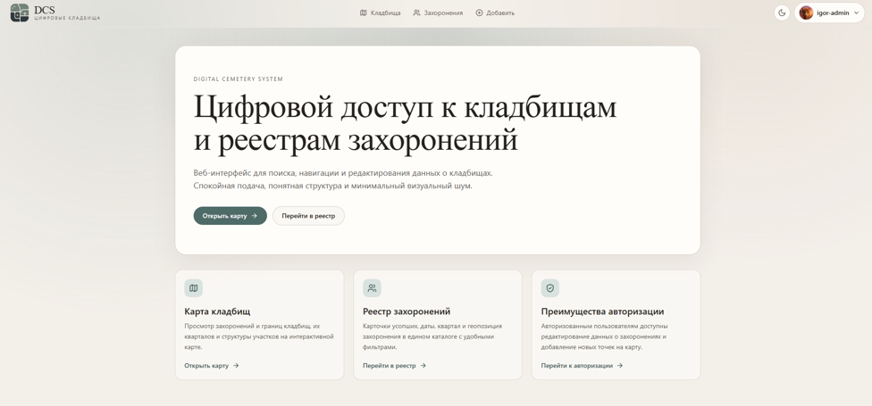
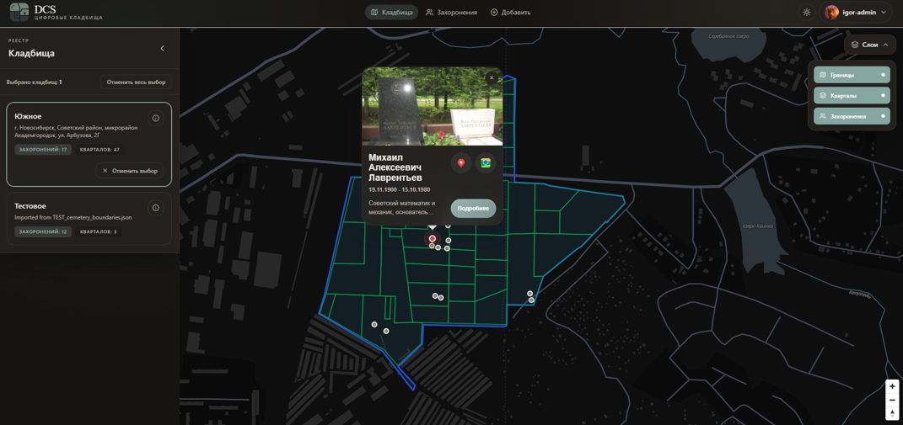
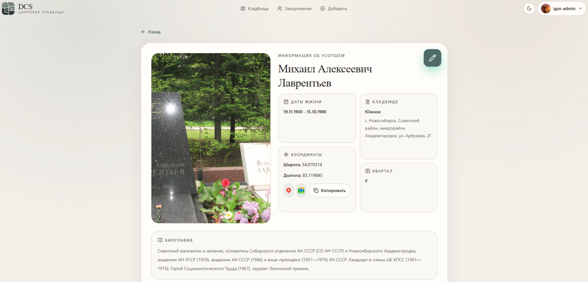
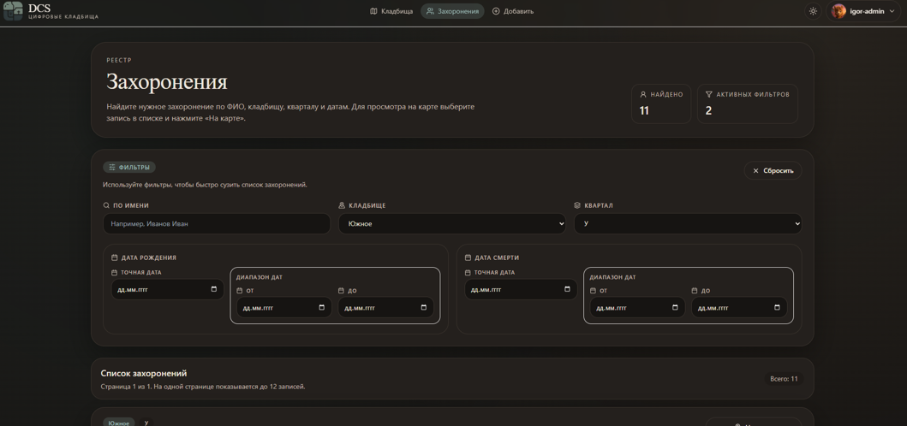
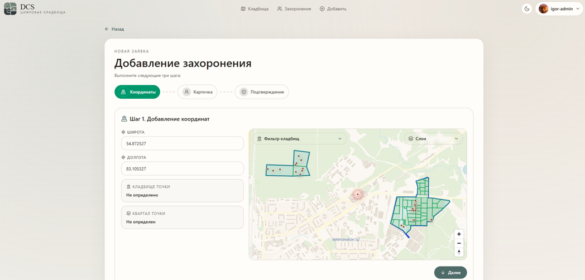
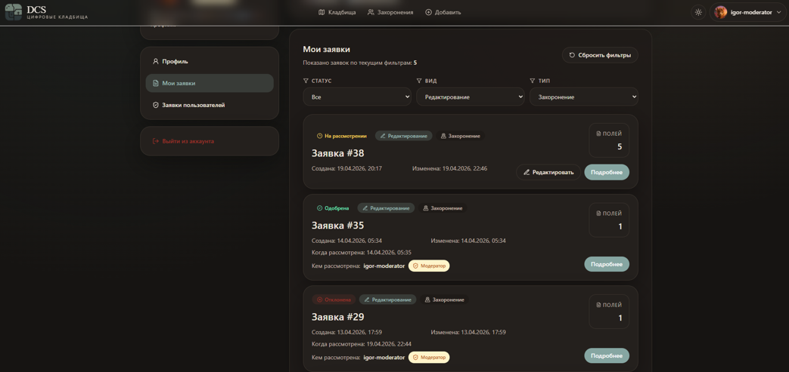
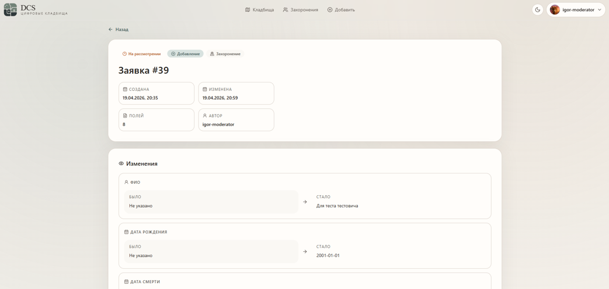
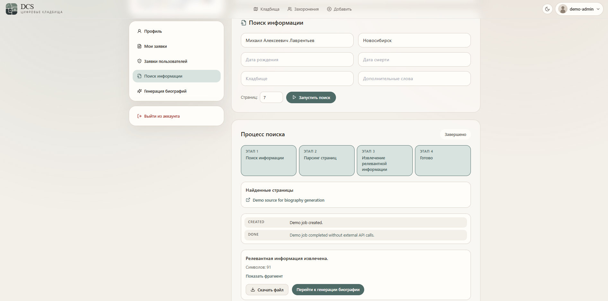
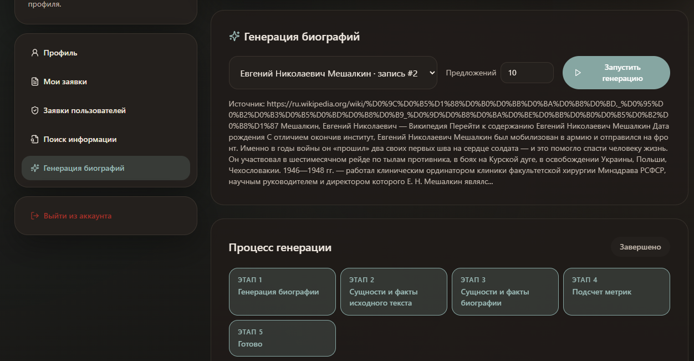
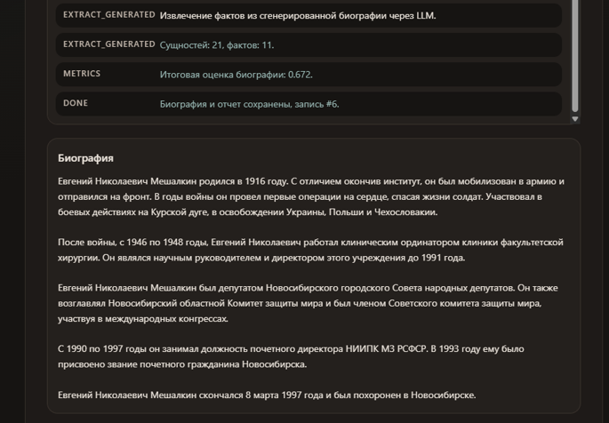

# Web Client

Публичный web-интерфейс Digital Cemetery System на Next.js и React. Приложение показывает карту кладбищ, реестр захоронений, карточки усопших, авторизацию, профиль, заявки на изменение данных и административные сценарии поиска информации/генерации биографий.

**Публичное демо:** https://digital-cemetery-demo.vercel.app

Демо развёрнуто на Vercel и работает без публичного backend: необходимые API маршруты обслуживаются внутри `client-web` через Next.js Route Handlers и demo-данные.

## Возможности

- интерактивная карта кладбищ, секторов и маркеров захоронений;
- реестр захоронений с поиском и фильтрами;
- детальная карточка усопшего с фото, датами, местом и биографией;
- регистрация, вход, подтверждение почты, профиль пользователя;
- создание заявок на добавление захоронений;
- создание заявок на редактирование существующих захоронений;
- просмотр и редактирование своих pending-заявок;
- модерация заявок ролями `MODERATOR` и `ADMIN`;
- административный поиск публичной информации об усопших;
- генерация биографий через LLM-пайплайн и просмотр отчёта фактичности.

## Скриншоты

<table>
  <tr>
    <td width="50%">
      <strong>Основной приветственный экран</strong><br>
      
    </td>
    <td width="50%">
      <strong>Интерактивная карта кладбищ</strong><br>
      
    </td>
  </tr>
  <tr>
    <td width="50%">
      <strong>Подробная информация об усопшем</strong><br>
      
    </td>
    <td width="50%">
      <strong>Поиск по реестру захоронений с фильтрами</strong><br>
      
    </td>
  </tr>
  <tr>
    <td width="50%">
      <strong>Создание заявки на добавление или редактирование</strong><br>
      
    </td>
    <td width="50%">
      <strong>Профиль и мои заявки</strong><br>
      
    </td>
  </tr>
  <tr>
    <td width="50%">
      <strong>Модерация заявок</strong><br>
      
    </td>
    <td width="50%">
      <strong>Поиск информации об усопшем</strong><br>
      
    </td>
  </tr>
  <tr>
    <td width="50%">
      <strong>LLM-генерация биографии</strong><br>
      
    </td>
    <td width="50%">
      <strong>Отчёт фактичности биографии</strong><br>
      
    </td>
  </tr>
</table>

## Стек

- Next.js 16 App Router;
- React 18;
- TypeScript;
- Tailwind CSS;
- MapLibre GL;
- Axios;
- Next.js Route Handlers;
- HttpOnly cookie sessions;
- lucide-react;
- date-fns;
- Jest;
- React Testing Library;
- jest-dom;
- ESLint;
- Docker / Docker Compose;
- Vercel.

## Инженерные акценты

- Компонентный UI на React/TypeScript с разделением `app`, `components`, `core/api`, `core/auth`, `core/demo`.
- Интеграция с REST API через сервисный слой и Route Handlers.
- Два режима работы: настоящий backend через API Gateway и автономное публичное demo без backend.
- Role-based workflows: пользователь, модератор, администратор.
- Работа с состояниями загрузки, ошибок, пустых списков и защищённых действий.
- Map UI: отображение границ, секторов, маркеров, карточек и выбора координат.
- Тесты для UI-компонентов и core-логики через Jest и React Testing Library.
- Docker Compose запуск полного локального контура через `ops-monitoring`.

## Демо-режим

Подробная инструкция находится в [DEMO.md](DEMO.md).

Публичное демо на Vercel уже настроено через `vercel.json`:

- `DCS_DEMO_MODE=true`;
- `NEXT_PUBLIC_DCS_DEMO_MODE=true`;
- `SESSION_COOKIE_SECURE=true`.

Демо-аккаунты:

- `user@demo.local` / `demo12345`;
- `moderator@demo.local` / `demo12345`;
- `admin@demo.local` / `demo12345`.

Локальный запуск demo через Docker:

```powershell
cd D:\NSU\Diploma\DigitalCemeterySystem\ops-monitoring
docker compose -f compose/docker-compose.demo.yml --env-file .env.demo up -d --build
```

После запуска открыть `http://localhost:3002`.

## Полный локальный режим

В полном режиме `client-web` работает с настоящей серверной частью через API Gateway. Контур запускается из `ops-monitoring`:

```powershell
cd D:\NSU\Diploma\DigitalCemeterySystem\ops-monitoring
docker compose -f compose/docker-compose.local.yml --env-file .env.local up -d --build
```

После запуска:

- web: `http://localhost:3001`;
- API Gateway: `http://localhost:8080`;
- Prometheus: `http://localhost:9090`;
- Grafana: `http://localhost:3000`.

При отдельном запуске клиента рядом с уже поднятым backend:

```powershell
cd D:\NSU\Diploma\DigitalCemeterySystem\client-web
npm install
$env:API_URL = 'http://localhost:8080'
$env:NEXT_PUBLIC_API_URL = 'http://localhost:8080'
$env:DCS_DEMO_MODE = 'false'
$env:NEXT_PUBLIC_DCS_DEMO_MODE = 'false'
$env:SESSION_COOKIE_SECURE = 'false'
npm run dev
```

После запуска открыть `http://localhost:3000`.

## Переменные окружения

| Переменная | Назначение |
| --- | --- |
| `DCS_DEMO_MODE` | Включает демонстрационный API на стороне Next.js. |
| `NEXT_PUBLIC_DCS_DEMO_MODE` | Дублирует demo-режим для клиентского кода. |
| `SESSION_COOKIE_SECURE` | Включает secure-cookie для HTTPS. На Vercel должно быть `true`, локально обычно `false`. |
| `API_URL` | Внутренний URL API Gateway для серверных запросов Next.js. |
| `NEXT_PUBLIC_API_URL` | Публичный URL API Gateway для локальных сценариев и совместимости. |
| `DCS_LEGACY_API_REWRITES` | Включает старое правило Next.js для перенаправления `/api/*` на backend. Обычно не требуется. |

## Проверки

```bash
npm run lint
npm run typecheck
npm run test:ci
npm run build
```

Тесты в проекте покрывают часть UI и core-логики:

- `src/components/ui/ConfirmDialog.test.tsx`;
- `src/core/auth/role-presentation.test.ts`;
- `src/core/utils/image-source.test.ts`.

## Демо-данные

Демо-режим использует данные из `src/demo-data`:

- `TEST_cemetery_boundaries.json`;
- `YUZHNOE_cemetery_boundaries.json`;
- `graves_data.json`.

Границы кладбищ отображаются как отдельные кладбища, `quarterBoundaries` используются как секторы, а захоронения из `graves_data.json` привязываются к кладбищам и секторам по координатам.
